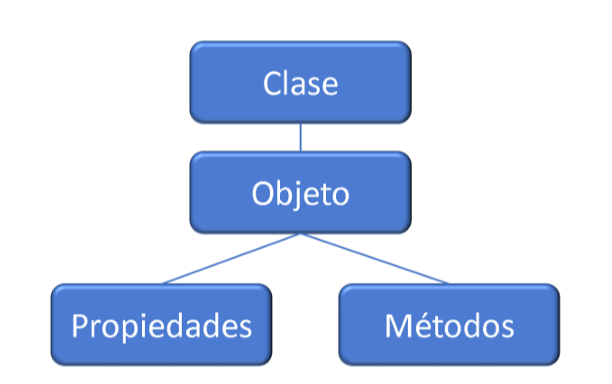

# __*CUESTIONARIO*__ 


# *¿Para qué usamos Clases en Python?*

__Las clases en Python__, son la estructura o plantilla que utiliza la POO (Programacion Orientada a Objetos) cuando los progarmas necesitan decenas o cientos de Objetos que tengan metodos y propiedades similares.  

Definamos __POO__. __La Programación Orientada a Objetos__ es un paradigma de programación que se centra en los "__objetos__". Estos __objetos__ son instancias de "clases", que actúan como plantillas o moldes para definir atributos (datos) y métodos (comportamientos).  
 Los pilares fundamentales de la __POO__ son:

__*Abstracción*__: Permite trabajar con conceptos sin preocuparnos por su implementación interna.

__*Encapsulamiento*__: Protege los datos restringiendo el acceso directo y permite interactuar con ellos mediante métodos.

__*Herencia*__: Facilita la creación de nuevas clases basadas en clases ya existentes, reutilizando código.

__*Polimorfismo*__: Permite que objetos de distintas clases sean tratados como objetos de una clase base común.




### __*CLASES*__.  

Una clase es un concepto abstracto que define atributos (propiedades) y métodos (comportamientos) que un objeto puede tener. __Las clases de Python__ actúan como plantillas para crear objetos concretos, que son instancias de esa clase. Por ejemplo, una clase podría llamarse Coche y podría tener atributos como color y marca, y métodos como __conducir__ o __frenar__.

Las clases proveen una forma de empaquetar datos y funcionalidad juntos. Al crear una nueva clase, se crea un nuevo tipo de objeto, permitiendo crear nuevas instancias de ese tipo. 

Cada instancia de clase puede tener atributos adjuntos para mantener su estado. Las instancias de clase también pueden tener métodos (definidos por su clase) para modificar su estado.

__*Sintaxis de clase*__:  

```python
class NombreClase:
```

Por convenio los nombres de las clases comienzan en mayúsculas. Si no lo ponemos en mayúsculas no vamos a tener ningún fallo, es simplemente código de buenas prácticas de programación.

__*Ejemplo*__:  

```python
class Perro:
    Pass
```    
Esta clase no hace nada todavía, pero sirve como punto de partida para aprender cómo se estructuran.

### *Qué es un objeto*.  

Un ejemplo sencillo de un __objeto__, podría ser un animal en concreto, por ejemplo un perro. Un perro tiene una edad, por lo que creamos un nuevo atributo de ‘edad’ y, además, puede envejecer, por lo que definimos un nuevo método. 
Datos y lógica, esto es lo que se define en muchos programas como la definición de una clase, que es la definición global y genérica de muchos __objetos__.

Un __objeto__ es una instancia de una clase. Esto significa que cada __objeto__ creado a partir de una clase comparte las características y comportamientos definidos en ella.  

__*Ejemplo*__:
```python
mi_perro = Perro()  # Crear un objeto (instancia) de la clase 'Perro'
```

 ### *Atributos y Métodos Básicos*.

__*Atributos*__:  

Los __atributos__ son las características de un objeto. Se definen dentro de una clase y pueden ser únicos para cada objeto (__atributos__ de instancia) o compartidos (__atributos__ de clase).

__Atributos de instancia__: Pertenecen a la instancia de la clase o al objeto. Son __atributos__ particulares de cada instancia, en nuestro caso de cada perro.

__Atributos de clase__: Se trata de __atributos__ que pertenecen a la clase, por lo tanto serán comunes para todos los objetos.

### *Ejemplo*:

```python
class Perro:
     especie = "canino"  # Atributo de clase

    def __init__(self, nombre, raza):
        self.nombre = nombre   # Atributo de instancia
        self.raza = raza
```        

__Métodos__:  

Los métodos son funciones dentro de una clase que definen el comportamiento de los objetos.
Ejemplo:
    def ladrar(self):
        print(f"{self.nombre} dice: ¡Guau!")


### *Ejemplo y explicación*: 

```python

class Perro:
    def __init__(self, nombre, raza):
        self.nombre = nombre
        self.raza = raza

    def ladrar(self):  # Método de instancia
        print(f"{self.nombre} dice: ¡Guau!")

# Crear una instancia de la clase Perro
mi_perro = Perro("Fido", "Labrador")

# Llamar al método ladrar
mi_perro.ladrar()  # Salida: Fido dice: ¡Guau!

```


### **1. Definición de la clase**
```python
class Perro:
```
- Usamos la palabra clave `class` para declarar una nueva clase en Python. Esto le indica al programa que estamos creando una estructura llamada `Perro`.
- El nombre de la clase (`Perro`) sigue la convención de usar **CamelCase**, donde cada palabra comienza con mayúscula.

En este punto, Python simplemente sabe que existe una "plantilla" llamada `Perro`, pero no tiene comportamiento ni datos definidos.

---

### **2. Constructor `__init__`** 
```python
def __init__(self, nombre, raza):
    self.nombre = nombre
    self.raza = raza
```
- **`def __init__`**: Es un **método especial** (también llamado constructor) que se ejecuta automáticamente cuando se crea una instancia de la clase.
- **Argumentos**:
  - `self`: Representa la instancia actual del objeto que se está creando. Es obligatorio en todos los métodos de instancia y permite acceder a los atributos y métodos del objeto.
  - `nombre`, `raza`: Son argumentos que el programador debe pasar al crear un objeto. Estos datos se usarán para inicializar los atributos del objeto.

- **`self.nombre = nombre`**: Asigna el valor proporcionado por el usuario al atributo `nombre` del objeto. Lo mismo ocurre con `self.raza`.

Este constructor asegura que cada vez que creamos un "perro", tendrá un `nombre` y una `raza` específicos, diferenciándolo de otros perros.

---

### **3. Definición del método de instancia**
```python
def ladrar(self):
    print(f"{self.nombre} dice: ¡Guau!")
```
- **`def`**: Declara un nuevo método llamado `ladrar`.
- **`self`**: Como en el constructor, representa la instancia actual, lo que permite acceder a los atributos del objeto, como `nombre`.
- **`print`**: Este método imprime un mensaje, combinando texto literal ("¡Guau!") con el valor del atributo `nombre`.

Este método modela el comportamiento de un perro que "ladra". Cada perro puede ejecutar este método, y la salida variará dependiendo de su atributo `nombre`.

---

### **4. Crear una instancia (un objeto de la clase)**
```python
mi_perro = Perro("Fido", "Labrador")
```
- **`mi_perro`**: Es la variable que almacena una **instancia** de la clase `Perro`.
- **`Perro("Fido", "Labrador")`**: Llama al constructor `__init__` de la clase `Perro`, pasando los valores `"Fido"` (nombre) y `"Labrador"` (raza).
- Internamente, Python asigna `"Fido"` al atributo `nombre` y `"Labrador"` al atributo `raza` de este nuevo objeto.

Este paso crea un "perro" concreto, con datos únicos que lo distinguen de otros.

---

### **5. Llamar al método de la instancia**
```python
mi_perro.ladrar()
```
- **`mi_perro.ladrar()`**: Llama al método `ladrar` definido en la clase `Perro`.
- Internamente, Python:
  1. Busca el método `ladrar` dentro de la clase `Perro`.
  2. Pasa automáticamente el objeto `mi_perro` como argumento a `self`.
  3. Accede a `self.nombre` para incluirlo en el mensaje de salida.

Salida: `"Fido dice: ¡Guau!"`

Este paso demuestra cómo un objeto puede "hacer cosas" (comportamientos) basándose en sus atributos.

---

### **Vista completa del flujo**
1. **Creamos la clase**: Esto le dice a Python cómo deberían lucir y comportarse los objetos del tipo `Perro`.
2. **Definimos el constructor**: Esto asegura que cada perro tenga un `nombre` y una `raza` únicos.
3. **Añadimos comportamientos**: El método `ladrar` define qué puede hacer un perro.
4. **Creamos una instancia**: Cada objeto de la clase `Perro` tiene sus propios datos (`nombre`, `raza`).
5. **Usamos el objeto**: Podemos llamar métodos como `ladrar` para que el perro "actúe".

---    

# *¿Qué método se ejecuta automáticamente cuando se crea una instancia de una clase?*

En Python, el método que se ejecuta automáticamente cuando se crea una instancia de una clase es el **`__init__`**. Este método es conocido como el "constructor" de la clase y se utiliza para inicializar los atributos de la instancia.

__*Por ejemplo*:__

```python
class Persona:
    def __init__(self, nombre, edad):
        self.nombre = nombre
        self.edad = edad

persona = Persona("Milton", 30)
print(persona.nombre)  # Salida: Milton
print(persona.edad)    # Salida: 30
```

En este caso, cuando se crea la instancia `Persona("Milton", 30)`, el método `__init__` se ejecuta automáticamente para asignar los valores a los atributos `nombre` y `edad`.  


### **Definición del método `__init__`**

El método **`__init__`** es un método especial en Python que se ejecuta automáticamente durante la creación de un objeto. Su propósito es inicializar los atributos del objeto y garantizar que cada instancia comience con valores establecidos.  

### *características principales*:

1. **Primer método que se ejecuta al instanciar una clase:**
   - Se llama automáticamente durante la creación del objeto, inmediatamente después de asignar memoria para la instancia.

2. **Método especial de inicialización:**
   - Forma parte de los métodos especiales de Python (denominados "dunder" porque tienen dos guiones bajos al inicio y al final).
   - Es específico para inicializar atributos de la instancia de la clase.

3. **No requiere invocación explícita:**
   - El programador no necesita llamar directamente a `__init__`; Python se encarga de ejecutarlo cuando se utiliza el constructor de la clase.

4. **Constructores predeterminados y parametrizados:**
   - Puede ser utilizado para asignar valores predeterminados cuando no se proporcionan argumentos.
   - También puede aceptar parámetros para personalizar la inicialización del objeto.

5. **Uso del parámetro `self`:**
   - `self` hace referencia a la instancia actual del objeto y permite acceder a sus atributos y métodos.

6. **Utilización en herencia:**
   - En el caso de clases que heredan de otras, es posible llamar al constructor de la clase base mediante `super()` para extender su funcionalidad.

7. **Flexibilidad con argumentos opcionales:**
   - Aunque no se permite la sobrecarga formal de constructores como en otros lenguajes, se pueden usar argumentos opcionales para simular diferentes comportamientos.

8. **No es el único método relacionado con la creación de objetos:**
   - Aunque se utiliza para inicialización, el método **`__new__`** es el encargado de crear realmente la instancia. Normalmente, `__new__` se utiliza en casos avanzados, como cuando se necesita controlar la creación de objetos de manera específica.

---

### Ejemplo para visualizar varios escenarios
Aquí te dejo un ejemplo para ilustrar algunos de estos puntos:

```python
class Ejemplo:
    def __init__(self, valor=None):
        if valor:
            self.valor = valor
        else:
            self.valor = "Predeterminado"

class SubEjemplo(Ejemplo):
    def __init__(self, valor, extra):
        super().__init__(valor)
        self.extra = extra

objeto1 = Ejemplo()
objeto2 = Ejemplo("Personalizado")
objeto3 = SubEjemplo("Avanzado", "Extra información")

print(objeto1.valor)  # Salida: Predeterminado
print(objeto2.valor)  # Salida: Personalizado
print(objeto3.valor)  # Salida: Avanzado
print(objeto3.extra)  # Salida: Extra información
```

---  

Toda clase de Python debe tener un __constructor__,  es 
obligatorio.  
De modo que, como norma general, siempre 
crearemos nosotros el constructor de nuestras 
clases, pero si no lo hacemos, Python lo creará por 
nosotros. Eso sí, lo crea vacío, sin atributos ni 
métodos por defecto.  

En Python, los __constructores__ pueden ser parametrizados, no parametrizados o predeterminados

Esta clasificación es clave para entender cómo inicializar objetos en Python de manera flexible y eficiente.


### **1. Constructor parametrizado**
Un constructor parametrizado permite inicializar una instancia con valores personalizados pasados como argumentos al momento de instanciar la clase. Esto da flexibilidad para adaptar el objeto a diferentes necesidades.

#### **Ejemplo**:
```python
class Persona:
    def __init__(self, nombre, edad):
        self.nombre = nombre
        self.edad = edad

persona = Persona("Milton", 30)
print(persona.nombre)  # Salida: Milton
print(persona.edad)    # Salida: 30
```
- **Ventaja**: Puedes inicializar atributos con valores específicos.
- **Uso**: Útil cuando el objeto necesita configurarse de manera particular desde el inicio.

---

### **2. Constructor no parametrizado**
Un constructor no parametrizado es un constructor que no recibe argumentos (excepto `self`). Inicializa los atributos con valores predeterminados. 

#### **Ejemplo**:
```python
class Animal:
    def __init__(self):
        self.especie = "Desconocida"
        self.edad = 0

animal = Animal()
print(animal.especie)  # Salida: Desconocida
print(animal.edad)     # Salida: 0
```
- **Ventaja**: Es simple y directo para objetos que no necesitan personalización inicial.
- **Uso**: Común para inicializar objetos "por defecto", cuando la personalización no es crítica.

---

### **3. Constructor predeterminado**
Un constructor predeterminado es el que Python genera automáticamente si no defines un método `__init__` en tu clase. Este constructor vacío permite crear instancias sin inicializar atributos explícitamente.

#### **Ejemplo**:
```python
class Vehiculo:
    pass

vehiculo = Vehiculo()
print(vehiculo)  # Salida: <__main__.Vehiculo object at 0x...>
```
- **Ventaja**: Útil para clases muy simples o temporales.
- **Limitación**: No permite inicializar atributos automáticamente; cualquier inicialización debe hacerse manualmente después de crear el objeto.

---

### **Comparación entre los tipos de constructores**

| Tipo de Constructor  | Recibe Argumentos | Inicializa Atributos | Uso Principal                                |
| -------------------- | ----------------- | -------------------- | -------------------------------------------- |
| **Parametrizado**    | Sí                | Con valores dados    | Configuración personalizada desde el inicio. |
| **No parametrizado** | No                | Con valores fijos    | Objeto con valores predeterminados.          |
| **Predeterminado**   | No                | No                   | Clases simples sin atributos predefinidos.   |

---  


### **_Métodos en una clase_**
En Python, los métodos de una clase son funciones definidas dentro de ella que realizan acciones o manipulan los datos del objeto (atributos). Hay tres tipos principales de métodos en una clase:
1. **Métodos de instancia**
2. **Métodos de clase**
3. **Métodos estáticos**

---

### **1. Métodos de instancia**
#### **Descripción:**
Un método de __instancia__ trabaja con una __instancia__ específica de la clase y puede acceder o modificar los atributos de esa __instancia__. El primer parámetro de estos métodos es siempre **`self`**, que representa la __instancia__ actual del objeto.

#### **Características:**
- Requieren una instancia para ser llamados.
- Usan el parámetro `self` para acceder a los atributos y otros métodos de la instancia.
- Son los métodos más comunes en las clases.

#### **Ejemplo práctico:**
```python
class Persona:
    def __init__(self, nombre, edad):
        self.nombre = nombre
        self.edad = edad

    def saludar(self):  # Método de instancia
        print(f"Hola, mi nombre es {self.nombre} y tengo {self.edad} años.")

# Crear una instancia de la clase
persona = Persona("Milton", 30)
persona.saludar()  # Salida: Hola, mi nombre es Milton y tengo 30 años.
```

#### **Cuándo utilizarlos:**
- Cuando necesitas trabajar con atributos o métodos específicos de una instancia.
- Cuando el comportamiento del método depende del estado del objeto (sus atributos).

---

### **2. Métodos de clase**
#### **Descripción:**
Los métodos de clase operan a nivel de clase, no a nivel de instancia, y trabajan con datos que pertenecen a la clase en sí. En lugar de `self`, usan **`cls`** como primer parámetro, que hace referencia a la clase actual.

#### **Características:**
- Se definen con el decorador `@classmethod`.
- Pueden ser llamados sin crear una instancia.
- Pueden acceder y modificar atributos o métodos de la clase, pero no los de una instancia en particular.

#### **Ejemplo práctico:**
```python
class Persona:
    poblacion = 0  # Atributo de clase

    def __init__(self, nombre):
        self.nombre = nombre
        Persona.poblacion += 1  # Incrementar población al crear una instancia

    @classmethod
    def obtener_poblacion(cls):  # Método de clase
        return cls.poblacion

# Crear instancias
persona1 = Persona("Milton")
persona2 = Persona("Lucía")

# Llamar al método de clase
print(Persona.obtener_poblacion())  # Salida: 2
```

#### **Cuándo utilizarlos:**
- Cuando necesitas operar sobre atributos de la clase en lugar de atributos de instancia.
- Para implementar constructores alternativos que permitan crear objetos de diferentes formas.

---

### **3. Métodos estáticos**
#### **Descripción:**
Un método estático pertenece completamente a la clase y no opera ni sobre la instancia (`self`) ni sobre la clase (`cls`). Es simplemente una función dentro de la clase, que no depende del estado del objeto ni de la clase.

#### **Características:**
- Se definen con el decorador `@staticmethod`.
- No reciben automáticamente ningún argumento (ni `self` ni `cls`).
- Se pueden llamar directamente desde la clase o una instancia.

#### **Ejemplo práctico:**
```python
class Calculadora:
    @staticmethod
    def sumar(a, b):  # Método estático
        return a + b

# Llamar al método estático
resultado = Calculadora.sumar(5, 3)
print(resultado)  # Salida: 8
```

#### **Cuándo utilizarlos:**
- Para operaciones que no necesitan acceder a datos específicos de la clase o de una instancia.
- Cuando una función lógica pertenece a la clase pero no requiere información de ella.

---

### **Comparación entre métodos de instancia, clase y estáticos**
| Tipo de Método          | Primer Parámetro | Acceso a atributos de instancia | Acceso a atributos de clase | Llamado desde instancia o clase |
| ----------------------- | ---------------- | ------------------------------- | --------------------------- | ------------------------------- |
| **Método de instancia** | `self`           | Sí                              | No                          | Desde una instancia             |
| **Método de clase**     | `cls`            | No                              | Sí                          | Desde clase o instancia         |
| **Método estático**     | Ninguno          | No                              | No                          | Desde clase o instancia         |

---

### **Ejemplo combinado**
Veamos un ejemplo en el que usamos los tres tipos de métodos juntos:

```python
class Persona:
    poblacion = 0  # Atributo de clase

    def __init__(self, nombre, edad):
        self.nombre = nombre
        self.edad = edad
        Persona.poblacion += 1

    def saludar(self):  # Método de instancia
        return f"Hola, soy {self.nombre}."

    @classmethod
    def obtener_poblacion(cls):  # Método de clase
        return f"Población actual: {cls.poblacion}"

    @staticmethod
    def descripcion():  # Método estático
        return "La clase Persona representa a las personas en este sistema."

# Uso de los métodos
persona1 = Persona("Milton", 30)
persona2 = Persona("Lucía", 25)

print(persona1.saludar())            # Método de instancia
print(Persona.obtener_poblacion())  # Método de clase
print(Persona.descripcion())        # Método estático
```

#### **Salida:**
```
Hola, soy Milton.
Población actual: 2
La clase Persona representa a las personas en este sistema.
```

---

¡Por supuesto! Aquí te dejo una explicación renovada y detallada sobre el **polimorfismo** en Python:

---

# **_¿Qué es el Polimorfismo en Python?_**
El **polimorfismo** es una característica de la Programación Orientada a Objetos que permite que un mismo método o interfaz sea utilizado por diferentes tipos de objetos, cada uno con su propio comportamiento. En palabras simples, es la capacidad de utilizar una sola operación para trabajar con distintos tipos de datos.

Python implementa el __polimorfismo__ de forma dinámica, lo que significa que puedes usar objetos de diferentes clases que compartan un método o funcionalidad común, sin importar la clase exacta a la que pertenecen.

---

### **Ejemplos y Principios del Polimorfismo en Python**

#### **1. Métodos comunes en diferentes clases**
Distintas clases pueden implementar métodos con el mismo nombre, pero cada clase define cómo se comportará ese método según su contexto.

```python
class Perro:
    def sonido(self):
        return "Ladrido"

class Gato:
    def sonido(self):
        return "Maullido"

# Uso de polimorfismo con diferentes tipos de objetos
animales = [Perro(), Gato()]
for animal in animales:
    print(animal.sonido())
```

**Salida:**
```
Ladrido
Maullido
```

Aquí, aunque los objetos (`Perro` y `Gato`) son de clases diferentes, comparten un método común (`sonido`). Esto permite que sean tratados de manera uniforme.

---

#### **2. Sobrescritura de métodos en herencia**
Cuando una clase base tiene un método, sus clases derivadas pueden sobrescribirlo para definir comportamientos específicos. Esto también es un ejemplo de polimorfismo.

```python
class Animal:
    def sonido(self):
        return "Sonido genérico"

class Perro(Animal):
    def sonido(self):
        return "Ladrido"

class Gato(Animal):
    def sonido(self):
        return "Maullido"

# Uso de polimorfismo en herencia
animales = [Animal(), Perro(), Gato()]
for animal in animales:
    print(animal.sonido())
```

**Salida:**
```
Sonido genérico
Ladrido
Maullido
```

En este caso, el método `sonido` de la clase base (`Animal`) es redefinido en las clases derivadas (`Perro` y `Gato`), permitiendo diferentes comportamientos para cada clase.

---

#### **3. Polimorfismo con duck typing**
Python usa el concepto de **duck typing**: *"Si parece un pato, camina como un pato y suena como un pato, entonces es un pato"*. Esto significa que la clase de un objeto no importa, siempre que implemente el método esperado.

```python
class Perro:
    def mover(self):
        return "Corriendo"

class Coche:
    def mover(self):
        return "Conduciendo"

# Polimorfismo basado en duck typing
objetos = [Perro(), Coche()]
for obj in objetos:
    print(obj.mover())
```

**Salida:**
```
Corriendo
Conduciendo
```

Aunque `Perro` y `Coche` no están relacionados, pueden usarse de manera polimórfica porque ambos implementan el método `mover`.

---
¡Sí, definitivamente podemos agregar esos puntos a las ventajas del **polimorfismo**! Aquí tienes una versión ampliada y organizada, incluyendo los beneficios que mencionaste:

---

### **Ventajas del Polimorfismo en Python**
1. **Permite que diferentes objetos se comporten de manera similar:**
   - El polimorfismo simplifica el trabajo con objetos diversos, ya que los métodos comunes permiten tratar a todos los objetos bajo una misma interfaz.

2. **Permite tratar objetos de diferentes clases de manera uniforme:**
   - Aunque las clases sean diferentes, si comparten métodos con nombres similares, los objetos pueden procesarse de forma uniforme sin preocuparse por la clase exacta a la que pertenecen.

3. **Facilita la extensión y modificación del código:**
   - Es fácil agregar nuevas clases o cambiar funcionalidades, ya que estas nuevas clases pueden integrarse sin alterar el código existente que utiliza el polimorfismo.

4. **Reutilización de código:**
   - Al permitir que diferentes objetos usen los mismos métodos o interfaces, se reduce la redundancia y se mejora la organización del código.

5. **Flexibilidad para trabajar con objetos:**
   - El polimorfismo hace que el código sea más adaptable y dinámico, lo que facilita el desarrollo de sistemas que puedan manejar varios tipos de objetos.

6. **Compatibilidad con el principio de sustitución de Liskov:**
   - El polimorfismo respeta este principio, que dice que los objetos de una clase derivada pueden reemplazar a los de la clase base sin alterar la funcionalidad del programa.

---


### **Conceptos Clave Relacionados**
1. **Interfaz común**:  Crear clases diferentes con métodos que comparten el mismo nombre pero comportamientos específicos.  
Los métodos que comparten el mismo nombre y propósito forman una interfaz común, lo que facilita el polimorfismo.
2. **Herencia**: Definir métodos en una clase base que son redefinidos en clases derivadas.  
Las clases pueden sobrescribir métodos de sus clases base, aprovechando el polimorfismo en la jerarquía de clases.
1. **Duck typing**:  Usar objetos diferentes sin importar su clase, siempre que implementen un método común. Python no requiere que los objetos pertenezcan a la misma clase, lo que amplía las posibilidades del polimorfismo.

---


### **¿Cómo usar el polimorfismo en Python?**
El polimorfismo en Python se utiliza principalmente a través de:
1. **Métodos comunes**:
2. **Herencia y sobrescritura**: 
3. **Duck typing**:
```python
class Forma:
    def area(self):
        pass  # Método vacío que será sobrescrito.

class Cuadrado(Forma):
    def __init__(self, lado):
        self.lado = lado

    def area(self):
        return self.lado * self.lado

class Circulo(Forma):
    def __init__(self, radio):
        self.radio = radio

    def area(self):
        return 3.14 * self.radio * self.radio

# Usando polimorfismo:
formas = [Cuadrado(4), Circulo(3)]
for forma in formas:
    print(forma.area())
```

#### Salida:
```
16
28.26
```

Aquí usamos polimorfismo para tratar las formas (`Cuadrado`, `Circulo`) de manera uniforme, aunque cada una calcula su área de forma diferente.

---

### **Sobrecarga en Python**
__La sobrecarga__ es un concepto relacionado con el polimorfismo que permite reutilizar operadores o nombres de métodos con diferentes comportamientos. En Python, la sobrecarga se clasifica en dos categorías:

#### **1. Sobrecarga de operadores**
La sobrecarga de operadores permite redefinir el comportamiento de operadores como `+`, `-`, `*`, etc., para objetos personalizados. Esto se logra mediante los **métodos dunder** (métodos especiales).

#### Ejemplo de sobrecarga del operador `+`:
```python
class Nombre:
    def __init__(self, primer_nombre, apellido):
        self.primer_nombre = primer_nombre
        self.apellido = apellido

    def __add__(self, otro):
        return f"{self.primer_nombre} {otro.apellido}"

# Crear dos objetos de la clase Nombre
persona1 = Nombre("Milton", "García")
persona2 = Nombre("Ana", "Pérez")

# Usar el operador + sobrecargado
resultado = persona1 + persona2
print(resultado)  # Salida: Milton Pérez
```

En este caso, sobrecargamos el operador `+` usando el método especial `__add__` para combinar el `primer_nombre`de un objeto con el `apellido` del otro.

---

#### **2. Sobrecarga de métodos**
Aunque Python no soporta **sobrecarga de métodos** de manera formal como otros lenguajes (Java o C++), puedes simularla utilizando parámetros opcionales o valores predeterminados.

#### Ejemplo de sobrecarga de métodos:
```python
class Calculadora:
    def sumar(self, a=None, b=None, c=None):
        if c is not None:
            return a + b + c
        elif b is not None:
            return a + b
        else:
            return a

calc = Calculadora()
print(calc.sumar(5))         # Salida: 5
print(calc.sumar(5, 10))     # Salida: 15
print(calc.sumar(5, 10, 20)) # Salida: 35
```

Aquí, el método `sumar` puede aceptar uno, dos o tres argumentos y ajustar su comportamiento dinámicamente.

---

### **Comparación entre Sobrecarga de Operadores y Métodos**
| **Categoría**                | **Características**                                                                               |
| ---------------------------- | ------------------------------------------------------------------------------------------------- |
| **Sobrecarga de operadores** | Redefine operadores como `+`, `-`, `*`, etc. usando métodos dunder (`__add__`, etc.).             |
| **Sobrecarga de métodos**    | Ajusta el comportamiento de un método utilizando parámetros opcionales o valores predeterminados. |

---

### **Ventajas de la sobrecarga y polimorfismo combinados**
1. **Reutilización de código**: Puedes usar operadores y nombres de métodos comunes para diferentes propósitos.
2. **Flexibilidad**: Los objetos pueden comportarse de manera personalizada según la operación o los argumentos utilizados.
3. **Extensibilidad**: Es fácil agregar nuevas funcionalidades a través de la sobrecarga y el polimorfismo.

---


# *¿Qué es un método dunder?*


### **1. Introducción**
Los métodos mágicos, también llamados *dunder methods* (por "Double UNDERscore"), son funciones especiales en Python que tienen dos guiones bajos antes y después de su nombre, como `__init__` y `__str__`. Estos métodos permiten a los desarrolladores personalizar el comportamiento de las clases y objetos para integrarse mejor con las características incorporadas de Python.

__*Por ejemplo*:__
- Hacer que una instancia sea iterable.
- Definir cómo se imprime un objeto.
- Personalizar operaciones aritméticas o de comparación.

En esencia, son la clave para construir clases que se comporten como tipos nativos de Python.

---

### **2. Operaciones Aritméticas**

Los métodos mágicos aritméticos se llaman cuando se utiliza un operador matemático con una instancia de clase. Esto permite personalizar comportamientos para operaciones como suma, resta, multiplicación, entre otras.

**Lista de métodos y operadores:**

| Nombre              | Método         | Operador | Descripción                    |
| ------------------- | -------------- | -------- | ------------------------------ |
| **Suma**            | `__add__`      | `+`      | Implementa la suma.            |
| **Resta**           | `__sub__`      | `-`      | Implementa la sustracción.     |
| **Multiplicación**  | `__mul__`      | `*`      | Implementa la multiplicación.  |
| **División**        | `__truediv__`  | `/`      | Implementa la división.        |
| **División Entera** | `__floordiv__` | `//`     | Implementa la división entera. |

**_Ejemplo práctico_:**
```python
class Numero:
    def __init__(self, valor):
        self.valor = valor

    def __add__(self, otro):
        return Numero(self.valor + otro.valor)

    def __str__(self):
        return f"Valor: {self.valor}"

a = Numero(10)
b = Numero(20)
print(a + b)  # Resultado: Valor: 30
```

---

### **3. Operaciones de Comparación**

Estos métodos personalizan el comportamiento de los operadores relacionales, permitiendo comparar objetos de manera lógica y significativa.

**Lista de métodos y operadores:**

| Nombre                | Método   | Operador | Descripción                      |
| --------------------- | -------- | -------- | -------------------------------- |
| **Menor que**         | `__lt__` | `<`      | Implementa la comparación menor. |
| **Mayor que**         | `__gt__` | `>`      | Implementa la comparación mayor. |
| **Igual a**           | `__eq__` | `==`     | Implementa igualdad.             |
| **Menor o igual que** | `__le__` | `<=`     | Implementa menor o igual.        |
| **Mayor o igual que** | `__ge__` | `>=`     | Implementa mayor o igual.        |

**Ejemplo práctico:**
```python
class Producto:
    def __init__(self, precio):
        self.precio = precio

    def __lt__(self, otro):
        return self.precio < otro.precio

producto1 = Producto(100)
producto2 = Producto(200)
print(producto1 < producto2)  # Resultado: True
```

---

### **4. Métodos del Ciclo de Vida**

Estos métodos son fundamentales para gestionar la creación y destrucción de objetos.

| Nombre          | Método     | Descripción                                          |
| --------------- | ---------- | ---------------------------------------------------- |
| **Constructor** | `__init__` | Inicializa el objeto tras su creación.               |
| **Borrado**     | `__del__`  | Se llama al eliminar el objeto, útil para limpieza.  |
| **Nuevo**       | `__new__`  | Controla la creación del objeto antes de `__init__`. |

**Ejemplo práctico:**
```python
class Recurso:
    def __init__(self, nombre):
        self.nombre = nombre
        print(f"Recurso {self.nombre} inicializado.")

    def __del__(self):
        print(f"Recurso {self.nombre} destruido.")

r = Recurso("Base de datos")
del r
```

---

### **5. Métodos de Representación**

Definen cómo se representará un objeto, ya sea para usuarios finales o desarrolladores.

| Nombre   | Método     | Descripción                                |
| -------- | ---------- | ------------------------------------------ |
| **Str**  | `__str__`  | Representación legible por humanos.        |
| **Repr** | `__repr__` | Representación orientada al desarrollador. |

**Ejemplo práctico:**
```python
class Usuario:
    def __init__(self, nombre):
        self.nombre = nombre

    def __str__(self):
        return f"Usuario: {self.nombre}"

    def __repr__(self):
        return f"Usuario('{self.nombre}')"

u = Usuario("Milton")
print(str(u))  # Usuario: Milton
print(repr(u)) # Usuario('Milton')
```

---  


### **6. Métodos mágicos para manejo de colecciones e iteración**

Los métodos mágicos relacionados con colecciones e iteración permiten que nuestras clases personalizadas se comporten como estructuras nativas de Python, como listas, diccionarios o iteradores. Esto les da una flexibilidad y funcionalidad excepcional.

#### **6.1 Métodos para manejo de índices y elementos**
Estos métodos permiten a nuestras clases actuar como contenedores indexables:

- **`__getitem__(self, key)`**: Controla el acceso a elementos mediante índices o claves.
- **`__setitem__(self, key, value)`**: Permite asignar valores a índices o claves.
- **`__delitem__(self, key)`**: Facilita la eliminación de elementos.

**_Ejemplo práctico_:**
```python
class MiColeccion:
    def __init__(self, elementos):
        self.elementos = elementos

    def __getitem__(self, indice):
        return self.elementos[indice]

    def __setitem__(self, indice, valor):
        self.elementos[indice] = valor

    def __delitem__(self, indice):
        del self.elementos[indice]

coleccion = MiColeccion([10, 20, 30])
print(coleccion[1])  # Acceso: 20
coleccion[1] = 50    # Asignación
del coleccion[2]     # Eliminación
print(coleccion.elementos)  # Resultado: [10, 50]
```

#### **6.2 Métodos de iteración**
Estos métodos convierten nuestras clases en iteradores, facilitando su uso en bucles y estructuras de control:

- **`__iter__(self)`**: Devuelve un objeto iterable.
- **`__next__(self)`**: Devuelve el siguiente elemento en cada iteración.

**Ejemplo práctico:**
```python
class Contador:
    def __init__(self, maximo):
        self.maximo = maximo
        self.actual = 0

    def __iter__(self):
        return self

    def __next__(self):
        if self.actual < self.maximo:
            self.actual += 1
            return self.actual
        else:
            raise StopIteration

for numero in Contador(3):
    print(numero)
# Resultado:
# 1
# 2
# 3
```

#### **6.3 Método `__len__` para colecciones**
Este método permite usar la función `len()` para obtener la longitud de una colección personalizada.

**_Ejemplo práctico_:**
```python
class MiColeccion:
    def __init__(self, elementos):
        self.elementos = elementos

    def __len__(self):
        return len(self.elementos)

coleccion = MiColeccion(['a', 'b', 'c', 'd'])
print(len(coleccion))  # Resultado: 4
```


### **7. Mejores Prácticas**

1. **Úsalos con moderación**: Limítate a los métodos que realmente enriquecen tu clase.
2. **Documenta los métodos**: Aclara en los comentarios qué hace cada método.
3. **Prueba el impacto en el rendimiento**: Métodos como `__getattr__` pueden ralentizar tu programa si no se usan adecuadamente.

---

### **8. Conclusión**

Los métodos mágicos en Python son herramientas poderosas para personalizar clases y objetos, permitiendo que se comporten como tipos nativos del lenguaje. Conociendo cómo usarlos adecuadamente, puedes crear clases más robustas y elegantes.

---  

# *¿Qué es un decorador de python?*


### **1. Introducción**
Los decoradores en Python son una forma sencilla y poderosa de modificar el comportamiento de funciones o métodos sin cambiar directamente su código. Básicamente, son funciones que envuelven otras funciones para extender o alterar su funcionalidad.

Por ejemplo, los decoradores son muy usados para:
- **Registro y depuración**: Añadir logs a funciones automáticamente.
- **Autorización**: Controlar el acceso a recursos dependiendo de permisos.
- **Optimización**: Modificar el comportamiento de funciones repetitivas.

Se implementan usando el símbolo `@` seguido del nombre del decorador.

---

### **2. ¿Cómo son los decoradores en Python?**

Los decoradores son funciones que reciben una función como argumento, realizan alguna operación (como extender su comportamiento), y devuelven una nueva función.

**Estructura básica:**
```python
def decorador(funcion):
    def envoltura():
        print("Esto ocurre antes de ejecutar la función.")
        funcion()
        print("Esto ocurre después de ejecutar la función.")
    return envoltura

@decorador
def saludar():
    print("¡Hola, Milton!")

saludar()
# Resultado:
# Esto ocurre antes de ejecutar la función.
# ¡Hola, Milton!
# Esto ocurre después de ejecutar la función.
```

---

### **3. ¿Para qué sirven los decoradores?**

Los decoradores tienen múltiples aplicaciones, entre las más comunes se encuentran:
1. **Añadir lógica adicional**: Sin tocar el código original de la función.
2. **Control de acceso**: Por ejemplo, verificar permisos antes de ejecutar una función.
3. **Transformación**: Modificar valores devueltos por una función.
4. **Reutilización**: Evitar escribir código repetitivo.

---

### **4. Tipos de decoradores**

#### **4.1 Decoradores para funciones simples**
Estos decoradores envuelven funciones sin argumentos.

**Ejemplo práctico:**
```python
def decorador_simple(funcion):
    def envoltura():
        print("Inicia ejecución.")
        funcion()
        print("Finaliza ejecución.")
    return envoltura

@decorador_simple
def tarea():
    print("Realizando tarea.")
```

#### **4.2 Decoradores para funciones con argumentos**
Se adaptan a funciones que reciben parámetros.

**Ejemplo práctico:**
```python
def decorador_con_args(funcion):
    def envoltura(*args, **kwargs):
        print("Argumentos:", args, kwargs)
        return funcion(*args, **kwargs)
    return envoltura

@decorador_con_args
def suma(a, b):
    return a + b

print(suma(3, 5))
# Argumentos: (3, 5) {}
# Resultado: 8
```

#### **4.3 Decoradores anidados**
Puedes encadenar múltiples decoradores en una función.

**Ejemplo práctico:**
```python
def decorador1(funcion):
    def envoltura():
        print("Decorador 1.")
        funcion()
    return envoltura

def decorador2(funcion):
    def envoltura():
        print("Decorador 2.")
        funcion()
    return envoltura

@decorador1
@decorador2
def tarea():
    print("Ejecutando tarea.")
```

---

### **5. Decoradores para clases**

Los decoradores también pueden aplicarse a clases, modificando su comportamiento.

**Ejemplo práctico:**
```python
def decorador_clase(clase):
    class NuevaClase:
        def __init__(self, *args, **kwargs):
            self.instancia = clase(*args, **kwargs)

        def __getattr__(self, nombre):
            print(f"Accediendo a {nombre}")
            return getattr(self.instancia, nombre)
    return NuevaClase

@decorador_clase
class MiClase:
    def __init__(self, valor):
        self.valor = valor

    def mostrar_valor(self):
        print(self.valor)

obj = MiClase(10)
obj.mostrar_valor()
# Accediendo a mostrar_valor
# Resultado: 10
```

---

### **6. Decoradores integrados en Python**

Python incluye decoradores predefinidos, como:
- **`@staticmethod`**: Define métodos estáticos.
- **`@classmethod`**: Define métodos de clase.
- **`@property`**: Convierte métodos en atributos.

**Ejemplo con `@staticmethod`:**
```python
class MiClase:
    @staticmethod
    def saludar():
        print("Hola desde un método estático.")

MiClase.saludar()  
```

~~~python

class Circulo:
    def __init__(self, radio):
        self._radio = radio

    @property
    def area(self):
        return 3.1416 * self._radio ** 2

c = Circulo(5)
print(c.area)  # Resultado: 78.54
~~~

---

### **7. Mejores prácticas**

1. **Mantén claridad**: Usa decoradores donde sean realmente necesarios para evitar confusión en el código.
2. **Documenta**: Explica el propósito de cada decorador que implementes.
3. **Evita anidación excesiva**: Decora funciones con moderación para no complicar el flujo lógico.

---

### **8. Conclusión**

Los decoradores en Python son herramientas extremadamente útiles para extender el comportamiento de funciones y clases de manera clara y reutilizable. Aunque pueden parecer complicados al principio, dominar su uso te ayudará a escribir código más limpio y eficiente.

---  

# *¿Qué es una API?*   

## Introducción
Las API, o interfaces de programación de aplicaciones, son realmente los héroes del desarrollo moderno de software. Permiten que distintos sistemas de software se comuniquen entre sí, haciendo posible la integración de servicios y la creación de aplicaciones. Dominar las API es una habilidad importante para cualquiera que quiera trabajar con datos en Python, especialmente si eres desarrollador. Puede que te sorprendan las puertas que se abren, porque cuando aprendas esta habilidad, podrás crear aplicaciones web, conectarte a servicios externos o incluso utilizar datos en tiempo real en proyectos de aprendizaje automático.

---

### Definición
Una API (Application Programming Interface) es un conjunto de reglas y protocolos que permite la comunicación entre diferentes aplicaciones. Es como un puente que conecta programas para que puedan intercambiar datos o funciones sin que los usuarios vean cómo funciona esa conexión.

### Conceptos clave
- **Interfaz:** Es el punto de conexión entre dos sistemas.
- **Protocolos:** Reglas que definen cómo interactuar (por ejemplo, REST o SOAP).
- **Ejemplo:** Una aplicación meteorológica utiliza la API de un servicio meteorológico para mostrar el clima actual.

---  


---

# **_¿Cuáles son los verbos de API?_**

### **Definición**
Los verbos de API se refieren a los métodos HTTP utilizados en las APIs REST para interactuar con recursos en un servidor. Estos métodos permiten realizar operaciones como leer, crear, actualizar y eliminar información, siguiendo el esquema de operaciones CRUD (Crear, Leer, Actualizar, Eliminar).  


### **Métodos principales**
1. **GET:** 
   - Obtiene datos de un recurso en el servidor.
   - **Ejemplo:** Recuperar información de un usuario en `https://api.ejemplo.com/usuarios/123`.

2. **POST:** 
   - Crea un nuevo recurso enviando datos al servidor.
   - **Ejemplo:** Enviar datos para registrar un nuevo usuario en `https://api.ejemplo.com/usuarios`.

3. **PUT:** 
   - Actualiza completamente un recurso existente en el servidor.
   - **Ejemplo:** Sobrescribir los datos de un usuario en `https://api.ejemplo.com/usuarios/123`.

4. **PATCH:** 
   - Actualiza parcialmente un recurso, modificando solo ciertas propiedades.
   - **Ejemplo:** Cambiar el email de un usuario en `https://api.ejemplo.com/usuarios/123`.

5. **DELETE:** 
   - Elimina un recurso en el servidor.
   - **Ejemplo:** Borrar un usuario específico en `https://api.ejemplo.com/usuarios/123`.

6. **HEAD:** 
   - Recupera los encabezados de una solicitud sin obtener el cuerpo de los datos.
   - **Ejemplo:** Consultar solo los metadatos de un recurso en `https://api.ejemplo.com/usuarios`.

7. **OPTIONS:** 
   - Obtiene información sobre los métodos HTTP permitidos para un recurso o servidor.
   - **Ejemplo:** Consultar las opciones disponibles en `https://api.ejemplo.com/usuarios`.

8. **TRACE:** 
   - Depura solicitudes mostrando el recorrido que siguen hasta el servidor.
   - **Ejemplo:** Verificar el flujo de una solicitud en una API en `https://api.ejemplo.com/usuarios`.

### **Conceptos clave**
- **HTTP:** Es el protocolo utilizado para la comunicación cliente-servidor en la web.
- **Operaciones CRUD:** Las bases de las interacciones en APIs REST.
- **REST:** Estilo arquitectónico que maximiza la eficiencia y la escalabilidad.  
  


### **Ejercicios prácticos**
1. Realiza peticiones GET, POST y DELETE en una API utilizando Postman.
2. Crea una API sencilla con un servidor local para practicar métodos PUT y PATCH.
3. Explora los métodos HEAD y OPTIONS en una API pública.

---


## **Terminología asociada a las APIs**

### **HTTP (HyperText Transfer Protocol)**
- **Definición:** Es el protocolo principal para la comunicación en Internet. Implementa métodos que determinan la dirección y la acción sobre los datos.
- **Métodos más comunes:**
  - **GET:** Recupera datos de un servidor.
  - **POST:** Envía nuevos datos a un servidor.
- **Otros métodos importantes:** PUT, PATCH, DELETE, HEAD, OPTIONS y TRACE.  
  

---

### **URL (Uniform Resource Locator)**
- **Definición:** Es la dirección de un recurso específico en la web. 
- **Estructura de una URL:**
  - **Protocolo:** Ejemplo, `http://` o `https://`.
  - **Dominio:** Ejemplo, `www.ejemplo.com`.
  - **Ruta opcional:** Ejemplo, `/usuario/123`.
- **Nota:** En el ámbito de las APIs, los términos **URL**, **request**, **URI** y **endpoint** tienen significados similares. Para mayor claridad, usaremos los términos **URL** y **request**.  


---

### **JSON (JavaScript Object Notation)**
- **Definición:** Es un formato de datos basado en texto que utiliza pares clave-valor. Diseñado para ser legible tanto por humanos como por máquinas.
- **Importancia:**
  - JSON es el formato más utilizado para el intercambio de datos en APIs.
  - Es compatible con la mayoría de lenguajes de programación.
- **Ejemplo en Python:**
  ```python
  import json
  
  datos = {"nombre": "Milton", "edad": 25}
  datos_json = json.dumps(datos)  # Convierte un diccionario a JSON
  print(datos_json)
  ```

---

### **REST (Representational State Transfer)**
- **Definición:** Es una metodología de diseño utilizada para construir APIs de manera eficiente y escalable.
- **Características principales:**
  - Las APIs REST se enfocan en recursos, identificados por URLs.
  - Utilizan métodos HTTP estándar como GET, POST, PUT y DELETE.
- **Ejemplo práctico:**
  - Un servicio REST puede exponer un recurso "usuarios" en la URL `http://api.ejemplo.com/usuarios`.

---

### **Flask (Framework para APIs en Python)**
- **Definición:** Flask es un framework en Python que permite desarrollar aplicaciones web y APIs de forma rápida y sencilla.
- **Instalación:**
  ```bash
  pip install flask
  ```
- **Ejemplo básico con Flask:**
  ```python
  from flask import Flask, jsonify

  app = Flask(__name__)

  @app.route('/api/saludo', methods=['GET'])
  def saludo():
      return jsonify({'mensaje': '¡Hola, desde Flask!'})

  if __name__ == '__main__':
      app.run(debug=True)
  ```

---

### **Notas prácticas**
- Puedes realizar solicitudes GET directamente desde un navegador introduciendo la URL.
- Flask es una herramienta versátil para crear APIs simples o complejas, combinándose perfectamente con JSON para enviar y recibir datos.

---  

# *¿Qué es Postman*.

Postman en sus inicios nace como una extensión que podía ser utilizada en el navegador Chrome de Google y básicamente nos permite realizar peticiones de una manera simple para testear APIs de tipo REST propias o de terceros.

Gracias a los avances tecnológicos, Postman ha evolucionado y ha pasado de ser de una extensión a una aplicación que dispone de herramientas nativas para diversos sistemas operativos como lo son Windows, Mac y Linux.  

__Postman__ es una herramienta de colaboración y desarrollo que permite a los desarrolladores interactuar y probar el funcionamiento de servicios web y aplicaciones. proporcionando una interfaz gráfica intuitiva y fácil de usar para enviar solicitudes a servidores web y recibir las respuestas correspondientes.

Con esta plataforma se puede gestionar diferentes entornos de desarrollo, organizar las solicitudes en colecciones y realizar pruebas automatizadas para verificar el comportamiento de los sistemas. 
Postman es utilizado por los desarrolladores para testear colecciones y catálogos APIs (tanto a nivel front-end como back-end), para gestionar el ciclo de vida de las APIs, mejorar el trabajo colaborativo y mejorar la organización del proceso de diseño y desarrollo.  

Con Postman, los desarrolladores pueden enviar peticiones HTTP (GET, POST, PUT, DELETE, entre otros), realizar pruebas automatizadas, y generar documentación detallada para las APIs, todo desde una interfaz gráfica amigable. Esta herramienta no solo ahorra tiempo, sino que también reduce errores en la programación de aplicaciones que requieren comunicación constante con servicios externos.  

### *Características de Postman*.  

__Colecciones de solicitudes__: Postman permite agrupar diferentes solicitudes en colecciones, lo cual facilita la organización de las pruebas y la reutilización de peticiones en distintos entornos de desarrollo.

__Pruebas__ automatizadas: Utilizando JavaScript, Postman permite la creación de scripts personalizados para automatizar pruebas y validar respuestas. Esto es esencial para garantizar que los servicios web funcionen correctamente en diferentes etapas del ciclo de desarrollo.

__Gestión de entornos__: Postman permite crear y gestionar distintos entornos (desarrollo, pruebas, producción) para probar cómo se comportan las APIs en diferentes configuraciones. Esto proporciona una gran flexibilidad a la hora de realizar pruebas sin necesidad de cambiar manualmente los parámetros.

__Generación de documentación__: La documentación es fundamental para que otros desarrolladores comprendan cómo interactuar con una API. Postman genera automáticamente documentación a partir de las solicitudes y las respuestas, haciendo que sea más sencillo compartir los detalles de la API con el equipo.  

### Ventajas de Usarlo
Postman se ha convertido en una herramienta indispensable gracias a sus múltiples ventajas. Estas facilitan la vida del desarrollador y mejoran la eficiencia en la gestión de APIs. Aquí te contamos las más relevantes:

Interfaz gráfica intuitiva: Postman ofrece una interfaz amigable y fácil de usar, que permite a los desarrolladores ejecutar pruebas sin necesidad de escribir código complejo. La posibilidad de interactuar de manera visual con las APIs reduce significativamente la curva de aprendizaje y favorece la productividad.

Compatibilidad multiplataforma: Postman es compatible con diversos sistemas operativos y puede ejecutarse en cualquier lugar, lo cual permite a los desarrolladores trabajar de manera colaborativa y sin restricciones. Además, su capacidad para soportar múltiples protocolos, como HTTP, HTTPS, y GraphQL, lo convierte en una herramienta versátil.

Mejora en la colaboración: Postman fomenta la colaboración en los equipos de desarrollo al permitir compartir colecciones de solicitudes y entornos. Esto facilita la integración de todos los miembros del equipo y asegura que todos trabajen sobre la misma base, mejorando la coordinación.

Versión gratuita: Postman ofrece un plan gratuito con características suficientes para equipos pequeños y proyectos individuales. Aunque también tiene una versión premium, la opción gratuita sigue siendo muy potente para los desarrolladores que recién comienzan a trabajar con APIs.

Automatización y productividad: Postman permite automatizar tareas repetitivas, como la ejecución de pruebas o la generación de documentación, lo cual incrementa la productividad del equipo. Los desarrolladores pueden enfocarse en resolver problemas más complejos y mejorar la calidad del software.

Postman no solo facilita el desarrollo y las pruebas de APIs, sino que también optimiza la documentación y fomenta la colaboración en equipos, posicionándose como una herramienta esencial en el desarrollo de aplicaciones modernas.  

--- 

# *¿Es MongoDB una base de datos SQL o NoSQL?*

### _**Definición de una base de datos**_
Una base de datos es un conjunto organizado de datos que se almacenan y gestionan electrónicamente. Estas son diseñadas para facilitar el acceso, la manipulación y el análisis de la información, y se utilizan en casi todos los campos, desde negocios y tecnología hasta ciencias y salud.

### _**Conceptos clave**_:
1. **Datos**: Información que puede ser almacenada, como números, texto, imágenes, etc.
2. **Sistema de gestión de bases de datos (DBMS)**: Es el software que permite crear, gestionar y operar bases de datos.
3. **Modelo de datos**: Cómo se estructuran los datos en una base de datos. Por ejemplo, tablas, documentos, gráficos, etc.
4. **Transacciones**: Operaciones que garantizan integridad y consistencia, como insertar, actualizar o eliminar datos.

### _**Tipos de bases de datos**_
1. **Bases de datos relacionales (SQL)**:
   - Utilizan tablas para estructurar los datos en filas y columnas.
   - Ejemplo: MySQL, PostgreSQL, SQL Server.

2. **Bases de datos NoSQL**:
   - No usan el modelo tabular. Son ideales para datos no estructurados o semi-estructurados.
   - Tipos: 
     - Documentales (MongoDB),
     - Columnares (Cassandra),
     - Grafos (Neo4j),
     - Clave-valor (Redis).

3. **Bases de datos distribuidas**:
   - Los datos están almacenados en múltiples ubicaciones físicas.
   - Ejemplo: Apache Cassandra.

4. **Bases de datos en memoria**:
   - Optimizadas para velocidad, los datos se almacenan en RAM.
   - Ejemplo: Redis.

5. **Bases de datos orientadas a objetos**:
   - Los datos se representan como objetos, similares a los lenguajes de programación orientados a objetos.
   - Ejemplo: db4o.  

--- 

## **_Diferencias clave entre bases de datos SQL y NoSQL_**

### **1. Modelo de almacenamiento de base de datos**
La forma en que las bases de datos almacenan datos es una de las diferencias más evidentes:
- **SQL**: Los datos se organizan en tablas compuestas por filas y columnas. Este modelo relacional es ideal para datos estructurados y relaciones complejas.
- **NoSQL**: Ofrecen varios modelos de almacenamiento, como documentos JSON, clave-valor, columnas agrupadas, o nodos/bordes de gráficos. Están diseñados para datos no estructurados.

---

### **2. Tipo de datos**
- **SQL**: Solo admiten datos estructurados, como registros en tablas, y requieren un esquema definido.
- **NoSQL**: Son capaces de manejar datos no estructurados o semi-estructurados en sus formatos nativos, como JSON.

---

### **3. Esquemas**
- **SQL**: Utilizan esquemas rígidos y predefinidos que requieren que los datos se alineen con la estructura especificada antes de ser ingresados.
- **NoSQL**: Utilizan esquemas flexibles que permiten datos con diferentes estructuras dentro de la misma colección.

---

### **4. Escalabilidad**
La manera de escalar un sistema varía significativamente:
- **SQL**: Se escalan verticalmente, agregando más recursos (CPU, memoria, almacenamiento) a un solo servidor. Aunque esto tiene límites físicos, es más adecuado para mantener la integridad y consistencia de los datos.
- **NoSQL**: Se escalan horizontalmente, añadiendo más nodos al sistema distribuido. Esto permite una expansión prácticamente ilimitada para manejar grandes volúmenes de datos.

---

### **5. Cumplimiento ACID**
- **SQL**: Garantizan las propiedades ACID (Atomicidad, Consistencia, Aislamiento y Durabilidad) para transacciones confiables, algo fundamental para sectores como banca y finanzas.
- **NoSQL**: Aunque la mayoría priorizan velocidad y escalabilidad, algunos sistemas distribuidos como **MongoDB Atlas** también ofrecen cumplimiento ACID.

---

### **6. Gestión de transacciones**
- **SQL**: La gestión de transacciones es más robusta en sistemas centralizados, asegurando integridad de los datos incluso con múltiples transacciones simultáneas.
- **NoSQL**: En sistemas distribuidos, la gestión de transacciones puede ser más compleja debido a la coordinación entre nodos.

---

### **7. Escalamiento horizontal y vertical**
- **SQL**: Escalamiento vertical con un único servidor que maneja todos los datos.
- **NoSQL**: Escalamiento horizontal mediante la adición de nodos al sistema distribuido, aumentando la capacidad del sistema.

---  


### **Conclusión**
Las bases de datos SQL y NoSQL tienen propósitos diferentes:
- **SQL** es ideal para aplicaciones que requieren relaciones complejas y garantizan integridad de datos, como sistemas financieros.
- **NoSQL** es más adecuado para manejar datos no estructurados, aplicaciones en tiempo real y sistemas distribuidos que necesitan escalabilidad.

---
  

### **Definición de MongoDB**
MongoDB es una base de datos __NoSQL__ orientada a documentos que almacena información en un formato similar a JSON llamado BSON. Se caracteriza por su flexibilidad y escalabilidad horizontal, lo que la convierte en una opción ideal para manejar datos no estructurados o semi-estructurados. Además, permite realizar consultas avanzadas, indexar los datos y ejecutar operaciones de agregación.

### **Propuesta única de MongoDB**
MongoDB propone un enfoque novedoso para el manejo de datos:
- **Flexibilidad en el esquema**: A diferencia de las bases de datos SQL tradicionales, MongoDB no requiere un esquema rígido. Esto permite que los desarrolladores trabajen con estructuras de datos dinámicas.
- **Alta escalabilidad**: Utiliza fragmentación para dividir los datos en varias máquinas y distribuir la carga de trabajo.
- **Orientación a documentos**: Cada registro (documento) puede contener datos complejos y anidados, facilitando el almacenamiento de información jerárquica.

### **Usos más comunes de MongoDB**
1. **Big Data**: Al manejar grandes volúmenes de datos, MongoDB es excelente para análisis en tiempo real.
2. **Aplicaciones móviles y web**: Su rendimiento rápido y escalabilidad lo hacen ideal para estas plataformas.
3. **Internet de las cosas (IoT)**: MongoDB se utiliza para almacenar y procesar datos generados por dispositivos conectados.
4. **Gestión de contenido**: En sitios web dinámicos que requieren flexibilidad en los tipos de contenido.
5. **Bases de datos distribuidas**: Funciona perfectamente en sistemas con múltiples ubicaciones de datos.  


---

### **La arquitectura de MongoDB y sus componentes**

#### **1. «_id» - El identificador único**
Cada documento en MongoDB contiene un campo obligatorio llamado «_id». Este actúa como clave primaria, garantizando que cada documento dentro de una colección sea único. 
Ejemplo:
```json
{
  "_id": "642eceab23e9b6d89a2f45e1",
  "nombre": "Milton",
  "edad": 30
}
```

---

#### **2. Documento - La unidad básica de datos**
Un documento equivale a un registro en una base de datos relacional. Contiene pares de nombre y valor, donde los nombres son similares a columnas en SQL y los valores representan datos. Es dinámico y puede contener datos estructurados o anidados.

Ejemplo:
```json
{
  "nombre": "Milton",
  "edad": 30,
  "hobbies": ["programación", "música"]
}
```

---

#### **3. Colección - Agrupando documentos**
Las colecciones son grupos de documentos que pueden tener estructuras variables. En MongoDB, no se requiere definir esquemas fijos. Esto permite máxima flexibilidad para datos no estructurados.

Ejemplo de colección:
```json
[
  { "nombre": "Milton", "edad": 30 },
  { "nombre": "Ana", "edad": 25 }
]
```

---

#### **4. Base de datos - Contenedores de colecciones**
MongoDB organiza las colecciones dentro de bases de datos. Cada base de datos tiene su propio conjunto de archivos en el sistema, lo que permite una fácil gestión y partición de datos.

---

#### **5. BSON y JSON - Los formatos de datos**
MongoDB utiliza BSON (Binary JSON) para optimizar el almacenamiento y la transferencia de datos. JSON sigue siendo útil para la interacción visual y el intercambio entre lenguajes de programación.

---  


### **_Funciones avanzadas: Índices y replicación_**
MongoDB incluye características avanzadas para mejorar el rendimiento y garantizar la disponibilidad:

#### **Índices**
Los índices permiten acelerar las consultas, especialmente en colecciones grandes. 
- **Tipos**: únicos, compuestos, geoespaciales, de texto y TTL (Time-To-Live).
- **Ejemplo de creación de un índice**:
  ```javascript
  db.miColeccion.createIndex({ nombre: 1 })  // Índice en el campo "nombre"
  ```

#### **Replicación**
La replicación garantiza la alta disponibilidad mediante el uso de Replica Sets.
- Un **Replica Set** consta de un servidor primario y varios secundarios que mantienen copias de los datos.
- Si el primario falla, uno de los secundarios toma su lugar automáticamente.
- **Ejemplo de configuración de Replica Set**:
  ```javascript
  rs.initiate({
      _id: "miReplicaSet",
      members: [
          { _id: 0, host: "localhost:27017" },
          { _id: 1, host: "localhost:27018" },
          { _id: 2, host: "localhost:27019" }
      ]
  })
  ```

---

### **_Ejemplo visual de la arquitectura_**
```plaintext
Base de datos: MiBaseDeDatos
|
|--- Colección: Usuarios
|    |--- Documento: { "_id": "1", "nombre": "Milton", "edad": 30 }
|    |--- Documento: { "_id": "2", "nombre": "Ana", "edad": 25 }
|
|--- Colección: Productos
|    |--- Documento: { "_id": "101", "producto": "Laptop", "precio": 1000 }
```

---

### **Guía práctica: Primeros pasos con MongoDB**

#### **Instalación**
- **Local**: Descarga MongoDB desde su [página oficial](https://www.mongodb.com/try/download/community).
- **En línea**: Usa MongoDB Atlas ([inicia aquí](https://www.mongodb.com/atlas)) para gestionar bases de datos en la nube.

#### **Uso básico con PyMongo (Python)**
Conecta, inserta y consulta datos fácilmente.

1. **Conectar a MongoDB**:
   ```python
   from pymongo import MongoClient
   client = MongoClient('mongodb://localhost:27017/')
   db = client['miBaseDeDatos']  # Crear/acceder a la base de datos
   ```

2. **Insertar datos**:
   ```python
   coleccion = db['miColeccion']
   coleccion.insert_one({"nombre": "Milton", "edad": 30})
   ```

3. **Consultar datos**:
   ```python
   for documento in coleccion.find():
       print(documento)
   ```

4. **Actualizar datos**:
   ```python
   coleccion.update_one({"nombre": "Milton"}, {"$set": {"edad": 31}})
   ```

5. **Eliminar datos**:
   ```python
   coleccion.delete_one({"nombre": "Milton"})
   ```


### **Conclusión**
MongoDB es una solución poderosa y flexible para manejar datos modernos, especialmente en aplicaciones que requieren escalabilidad y rendimiento. Con funcionalidades como índices avanzados y replicación, ofrece herramientas para afrontar retos complejos de gestión de datos.

---

